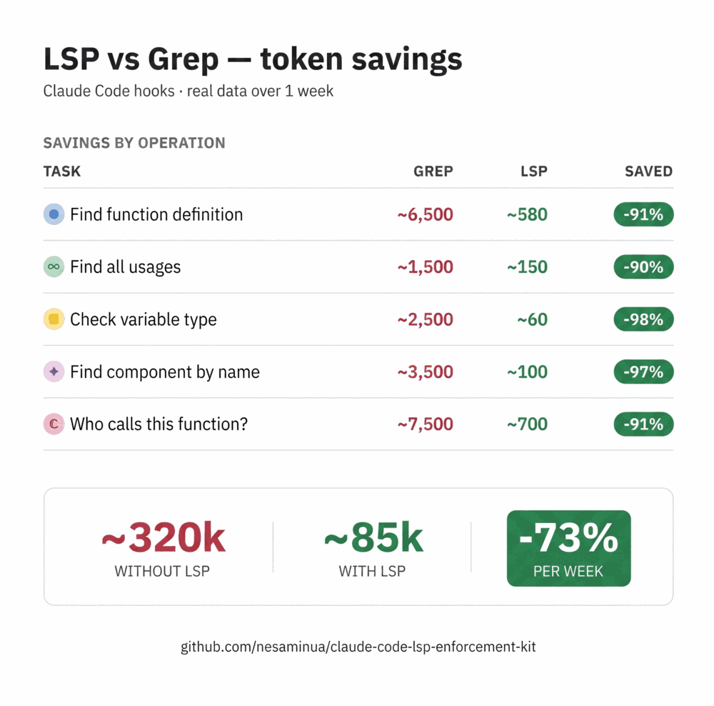

<h1 align="center">LSP Enforcement Kit</h1>

<p align="center">
  <strong>Physical enforcement of LSP-first navigation in Claude Code.</strong>
  <br>
  Stop burning tokens on Grep. Make Claude navigate code like an IDE — 100% of the time.
</p>

<p align="center">
  <a href="https://github.com/nesaminua/claude-code-lsp-enforcement-kit/releases"></a>
  <a href="LICENSE"></a>
  <a href="https://github.com/nesaminua/claude-code-lsp-enforcement-kit/stargazers"></a>
  
</p>

<p align="center">
  <a href="#-quick-start">Quick Start</a> &bull;
  <a href="#-the-problem">Why</a> &bull;
  <a href="#-token-savings-grep-vs-lsp-per-operation">Savings</a> &bull;
  <a href="#-architecture-6-hooks--1-tracker">Architecture</a> &bull;
  <a href="#-how-each-hook-works">Hooks</a> &bull;
  <a href="CHANGELOG.md">Changelog</a>
</p>

<p align="center">
  
</p>

---

## In Action

When Claude tries to `Grep` for a code symbol, the hook blocks with a copy-pasteable LSP command:

```
⛔ LSP-FIRST BLOCK: Pattern contains code symbol(s) — use LSP instead
Symbols: handleSubmit, UserService

LSP tools:
  handleSubmit:
    mcp__serena__find_referencing_symbols("handleSubmit")  (Serena)

  UserService:
    mcp__serena__find_symbol("UserService")  (Serena)
```

When Claude tries to `Read` a code file without warming up LSP, the progressive gate blocks:

```
🛡️  LSP-FIRST READ GATE — Gate 1: warmup required

  Call one of these first:
    mcp__serena__get_symbols_overview("src/page.tsx")  (Serena)

  CONCRETE CALL FOR THIS FILE (works in any project):
    mcp__serena__get_symbols_overview("src/page.tsx")

  After warmup: 2 free Reads, then need LSP navigation.
```

No generic advice. Every block message is parametrized by the actual file Claude tried to touch.

---

## ⚡ Quick Start

```bash
git clone https://github.com/nesaminua/claude-code-lsp-enforcement-kit.git
cd claude-code-lsp-enforcement-kit
bash install.sh
# Windows: pwsh ./install.ps1
```

Restart Claude Code. Done. The installer is idempotent — safe to re-run on upgrades.

Verify:

```bash
bash scripts/lsp-status.sh
```

---

## 🎯 The Problem

Claude Code defaults to **Grep + Read** for code navigation. This works, but it's wasteful:

```
"Where is handleSubmit defined?"

Grep approach:
  Grep("handleSubmit") → 23 matches, ~1500 tokens of output
  Read file1.tsx (wrong) → 2500 tokens
  Read file2.tsx (still wrong) → 2500 tokens
  Read file3.tsx (found it) → 2500 tokens
  ─────────────────────────────────────
  Total: ~9,000 tokens, 4 tool calls

LSP approach:
  find_symbol("handleSubmit") → form-actions.ts:42, ~80 tokens
  Read form-actions.ts:35-55 → ~150 tokens
  ─────────────────────────────────────
  Total: ~230 tokens, 2 tool calls
```

**~40x fewer tokens. Same answer.**

A rule in CLAUDE.md saying "use LSP" helps ~60% of the time. Hooks make it 100%.

## 💰 Token Savings: Grep vs LSP Per Operation

| Task | Grep approach | LSP approach | Saved |
|------|--------------|--------------|-------|
| Find definition of `handleSubmit` | Grep → 23 matches (~1500 tok) + 2 wrong Reads (~5000 tok) = **~6500 tok** | `find_symbol` → file:line (~80 tok) + 1 targeted Read (~500 tok) = **~580 tok** | **91%** |
| Find all usages of `UserService` | Grep → 15 matches (~1200 tok), scan results (~300 tok) = **~1500 tok** | `find_referencing_symbols` → 8 file:line pairs (~150 tok) = **~150 tok** | **90%** |
| Get overview of `form-actions.ts` | Read full file (~2500 tok), skim visually = **~2500 tok** | `get_symbols_overview` → top-level symbols (~120 tok) = **~120 tok** | **95%** |
| Find component `InviteForm` | Glob (~200 tok) + Grep (~800 tok) + Read wrong file (~2500 tok) = **~3500 tok** | `find_symbol("InviteForm")` → exact location (~100 tok) = **~100 tok** | **97%** |
| Who calls `validateToken`? | Grep → noisy results (~1500 tok) + 3 Reads to verify (~6000 tok) = **~7500 tok** | `find_referencing_symbols` → caller list (~200 tok) + 1 Read (~500 tok) = **~700 tok** | **91%** |

## 📊 Real-World Data: 1 Week, 2 Projects

Aggregate from a week of development across 2 TypeScript projects:

| Metric | With LSP | Without LSP (estimated) |
|--------|----------|------------------------|
| LSP navigation calls | 39 | — |
| Grep calls on code symbols | 0 (blocked) | ~120 |
| Unique code files Read | 53 | ~180 |
| Estimated navigation tokens | **~85k** | **~320k** |
| **Tokens saved** | | **~235k (~73%)** |

**How the estimate works:**
- Each blocked Grep saves ~1200 tokens of noisy output
- Each avoided Read saves ~1500 tokens of file content loaded into context
- 39 LSP calls cost ~4k tokens total (precise, compact results)
- Without LSP: ~120 Greps + ~180 Reads = ~315k tokens for the same navigation work
- With LSP: 39 nav calls + 53 targeted Reads = ~84k tokens

## 🏗️ Architecture: 6 Hooks + 1 Tracker

```
                    PreToolUse                          PostToolUse
                    ──────────                          ───────────

 Grep call ──→ [serena-first-guard.js] ──→ BLOCK
                  detects code symbols,
                  suggests Serena equivalent

 Glob call ──→ [serena-first-glob-guard.js] ──→ BLOCK
                  blocks *UserService*, **/handleFoo*.ts;
                  allows *.ts, *subdomain*, src/**

 Bash(grep) ──→ [serena-bash-grep-block.js] ──→ BLOCK
                  catches grep/rg/ag/ack
                  in shell commands

 Read(.tsx) ──→ [serena-first-read-guard.js] ──→ GATE
                  5 progressive gates
                  (warmup → orient → nav → surgical)

 Agent(impl) ─→ [serena-pre-delegation.js] ──→ BLOCK
                  subagents can't access MCP,
                  orchestrator must pre-resolve

 Serena call ──────────────────────────────────→ [serena-usage-tracker.js]
                                                   tracks nav_count,
                                                   read_count, state

                    SessionStart
                    ────────────

 New session ──→ [serena-session-reset.js] ──→ WIPE
                    clears stale nav_count for current cwd,
                    forces fresh warmup + re-enforces gates
```

> **v3 note:** the kit is Serena-only as of v3.0. If you installed an
> earlier version, re-run `bash install.sh` — the installer unlinks the
> old `lsp-*.js` hooks and `lib/detect-lsp-provider.js`, removes the
> `typescript-lsp` plugin enablement, and installs the new `serena-*`
> hooks plus `lib/serena.js`.

## 🔧 How Each Hook Works

### 1. `serena-first-guard.js` — Grep Blocker

**Hook type:** PreToolUse | **Matcher:** `Grep`

Intercepts every Grep call. Detects code symbols in the pattern. Blocks with a suggestion to use the correct LSP tool.

| Pattern | Detected as | Action |
|---------|------------|--------|
| `getUserById` | camelCase symbol | BLOCK |
| `UserService` | PascalCase symbol | BLOCK |
| `router.refresh` | dotted symbol | BLOCK |
| `write_audit_log` | snake_case function | BLOCK |
| `create-folder-modal` | component filename | BLOCK |
| `TODO` | keyword | allow |
| `NEXT_PUBLIC_URL` | env var (SCREAMING_SNAKE) | allow |
| `flex-col` | CSS class | allow |
| `*.md`, `*.json`, `*.sql` | non-code file glob | allow |
| `.task/`, `node_modules/` | non-code path | allow |

**Block message example:**
```
⛔ LSP-FIRST BLOCK: 1 code symbol(s) in Grep — use LSP instead
Symbols: handleSubmit
LSP tools:
  handleSubmit:
    mcp__serena__find_referencing_symbols("handleSubmit")  (Serena)
```

### 2. `serena-first-glob-guard.js` — Glob Symbol Blocker

**Hook type:** PreToolUse | **Matcher:** `Glob`

Closes the gap where Claude searches for a symbol by *filename pattern* instead of content. Without this hook, `Glob("*UserService*")` silently returns the file, Claude reads it, and LSP enforcement never fires.

The guard parses the glob pattern, extracts alphabetic tokens, and blocks if any token looks like a code symbol (PascalCase, camelCase, or snake_case with 3+ parts). Lowercase-only tokens and short generic words are always allowed.

| Pattern | Detected as | Action |
|---------|------------|--------|
| `*UserService*` | PascalCase symbol | BLOCK |
| `**/AuthProvider.tsx` | PascalCase in path | BLOCK |
| `*createOrder*` | camelCase symbol | BLOCK |
| `*handleSubmit*` | camelCase handler | BLOCK |
| `*get_user_sessions*` | snake_case function | BLOCK |
| `src/**/*.ts` | extension pattern | allow |
| `*.tsx`, `**/*.json` | extension pattern | allow |
| `*subdomain*`, `*auth*` | lowercase concept | allow |
| `**/middleware*` | file concept | allow |
| `tsconfig.json`, `next.config.ts` | framework config | allow |
| `README.md` | docs | allow |

**Allowed by design:** lowercase concept searches (`*auth*`, `*subdomain*`) are legitimate file discovery by topic. Only symbol-shaped tokens (casing patterns) are blocked, because those should use `find_symbol` instead.

### 3. `serena-bash-grep-block.js` — Shell Grep Blocker

**Hook type:** PreToolUse | **Matcher:** `Bash`

Same detection logic, but for `Bash(grep "UserService" src/)`, `Bash(rg handleSubmit)`, etc. Claude sometimes tries to bypass the Grep hook by shelling out.

Allows: `git grep` (history search), non-code paths, non-code file type filters.

### 4. `serena-first-read-guard.js` — Progressive Read Gate

**Hook type:** PreToolUse | **Matcher:** `Read`

The most sophisticated hook. Forces a "navigate first, read targeted" workflow through 5 gates:

```
Gate 1 — Warmup Required
  No LSP state file → BLOCK
  Must call get_symbols_overview(<the file you want to Read>) first

Gate 2 — Free Orientation (reads 1-2)
  ALLOW — explore freely, no restrictions

Gate 3 — Warning (read 3)
  WARN if no LSP nav calls yet
  "Next Read will be BLOCKED"

Gate 4 — Navigation Required (reads 4-5)
  BLOCK if nav_count < 1
  Must use at least 1 LSP navigation call

Gate 5 — Surgical Mode (reads 6+)
  BLOCK if nav_count < 2
  After 2 nav calls → unlimited reads forever
```

**Session flow:**
```
Session starts
  │
  ├─ Read(page.tsx) → Gate 1 BLOCKS → "warmup required"
  │
  ├─ get_symbols_overview("page.tsx") → tracker writes warmup_done=true
  │
  ├─ Read(page.tsx) → Gate 2 allows (1 of 2 free)
  ├─ Read(actions.ts) → Gate 2 allows (2 of 2 free)
  ├─ Read(types.ts) → Gate 3 WARNS
  ├─ Read(helpers.ts) → Gate 4 BLOCKS
  │
  ├─ find_symbol("MyFunc") → tracker: nav_count=1
  │
  ├─ Read(helpers.ts) → unlocked (reads 4-5)
  ├─ Read(utils.ts) → unlocked
  ├─ Read(service.ts) → Gate 5 BLOCKS
  │
  ├─ find_referencing_symbols("MyFunc") → tracker: nav_count=2
  │
  └─ SURGICAL MODE — all Reads unlimited
```

**Always allowed (no gate):**
- Non-code files: `.md`, `.json`, `.yaml`, `.env`, `.sql`, `.css`, `.html`
- Config files: `tsconfig.json`, `next.config.ts`, `package.json`
- Test files: `*.test.ts`, `*.spec.tsx`
- Non-code paths: `.task/`, `.claude/`, `node_modules/`, `__tests__/`

**Dedup:** Reading the same file at different line ranges counts as 1 Read.

### 5. `serena-pre-delegation.js` — Agent Pre-Resolution

**Hook type:** PreToolUse | **Matcher:** `Agent`

Claude Code subagents **cannot access MCP tools** — this is an architectural limitation of the platform. Without this hook, every delegated agent falls back to Grep+Read, bypassing all LSP enforcement.

```
// BLOCKED — no LSP context
Agent({
  prompt: "Fix handleSubmit in the form component",
  isolation: "worktree"
})

// ALLOWED — pre-resolved LSP context
Agent({
  prompt: `Fix handleSubmit error handling.

    ## LSP CONTEXT (pre-resolved by orchestrator)
    - handleSubmit: defined at form-actions.ts:42, called from page.tsx:15
    - FormComponent: defined at form.tsx:8, used in page.tsx:120`,
  isolation: "worktree"
})
```

**Three enforcement tiers:**

| Tier | Agents | Enforcement |
|------|--------|-------------|
| Force | `frontend-explorer`, `backend-explorer`, `db-explorer` | Always BLOCK without LSP context |
| Standard | Implementation agents, worktree-isolated agents | BLOCK during implement phase |
| Exempt | Reviewers, testers, planners, auditors | Never enforced (read-only) |

### 6. `serena-session-reset.js` — Stale State Wiper

**Hook type:** SessionStart | **Matcher:** `true` (runs on every session start)

The Read guard's state file (`~/.claude/state/lsp-ready-<cwd-hash>`) has a 24-hour expiry. Without this hook, a new session inherits yesterday's `nav_count` — and if that count was ≥ 2, the guard is permanently in **surgical mode** for today's session: unlimited Reads with zero LSP calls required. A full bypass of the enforcement chain.

This hook runs once on session start and deletes the state file for the current cwd. The next Read triggers Gate 1 (warmup required), forcing at least one `get_symbols_overview` call before any code file can be opened. After warmup, the standard progression kicks in (Gate 2 → 3 → 4 → 5) requiring real LSP navigation calls before surgical mode unlocks.

**Session lifecycle with reset:**
```
Session start
  │
  ├─ serena-session-reset.js → unlinks lsp-ready-<hash>
  │
  ├─ Read(page.tsx) → Gate 1 BLOCKS → "warmup required"
  │
  ├─ get_symbols_overview("page.tsx") → tracker writes warmup_done=true
  │
  ├─ Read × 2 (free) → Gate 3 warn → Gate 4 block → LSP nav → …
  │
  └─ (2 nav calls later) SURGICAL MODE unlocked
```

**Safety:** the hook only deletes the flag for the current cwd — other projects' state files are left alone. Failure is silent (never blocks session start).

### 7. `serena-usage-tracker.js` — State Tracker

**Hook type:** PostToolUse | **Matcher:** `mcp__serena__find_symbol|mcp__serena__find_referencing_symbols|mcp__serena__get_symbols_overview|mcp__serena__find_file|mcp__serena__search_for_pattern|mcp__serena__list_dir`

Tracks successful Serena calls in a per-project state file. Other hooks read this state to make gate decisions.

**State file:** `~/.claude/state/lsp-ready-<md5-hash-of-cwd>`

```json
{
  "cwd": "/path/to/project",
  "warmup_done": true,
  "nav_count": 25,
  "read_count": 38,
  "read_files": ["src/page.tsx", "src/actions.ts"],
  "timestamp": 1775818285727,
  "last_tool": "mcp__serena__find_referencing_symbols"
}
```

## 📦 Installation

### Option 1: Give the repo to Claude Code (recommended)

```bash
git clone https://github.com/nesaminua/claude-code-lsp-enforcement-kit.git
cd claude-code-lsp-enforcement-kit
```

Then tell Claude Code:

```
Run bash install.sh in this repo to set up LSP enforcement hooks.
```

The install script:
- Copies 7 hooks + shared `lib/serena.js` helper to `~/.claude/hooks/`
- Copies the LSP-first rule to `~/.claude/rules/`
- **Merges** hook registrations into your existing `~/.claude/settings.json` (won't overwrite your other hooks)
- Unlinks the old `lsp-*.js` hooks + `lib/detect-lsp-provider.js` if present (v2 cleanup)
- Removes the `typescript-lsp` plugin from `enabledPlugins` (no longer used)
- Creates `~/.claude/state/` for tracking
- Verifies everything at the end
- Safe to re-run: entries are deduped by command path, so upgrading from v2 to v3 just swaps hooks without touching your other settings

### Option 2: Run the script yourself

**macOS / Linux:**
```bash
git clone https://github.com/nesaminua/claude-code-lsp-enforcement-kit.git
cd claude-code-lsp-enforcement-kit
bash install.sh
```

**Windows (PowerShell):**
```powershell
git clone https://github.com/nesaminua/claude-code-lsp-enforcement-kit.git
cd claude-code-lsp-enforcement-kit
pwsh ./install.ps1
# or: powershell -ExecutionPolicy Bypass -File ./install.ps1
```

Output:
```
=== LSP Enforcement Kit — Install ===

[1/4] Directories ready
[2/4] Copied 7 hooks + lib + 1 rule
[3/4] settings.json updated (merged, not overwritten)
[4/4] Verifying...

  Hooks installed:  7/7
  Rule installed:   yes
  State directory:  yes

Done. Restart Claude Code to activate.
```

### Option 3: Manual setup

<details>
<summary>Click to expand manual steps</summary>

#### Prerequisites

- Claude Code (CLI, Desktop, or IDE extension)
- [Serena](https://github.com/oraios/serena) MCP server installed and connected

#### Step 1: Copy files

```bash
mkdir -p ~/.claude/hooks/lib ~/.claude/state ~/.claude/rules
cp hooks/*.js ~/.claude/hooks/
cp hooks/lib/serena.js ~/.claude/hooks/lib/
cp rules/lsp-first.md ~/.claude/rules/
```

#### Step 2: Register hooks in settings.json

**IMPORTANT:** If you already have hooks, **add** these entries to your existing arrays — don't replace them.

Add to `PreToolUse` array:

```json
{
  "matcher": "Grep",
  "hooks": [{ "type": "command", "command": "node ~/.claude/hooks/serena-first-guard.js" }]
},
{
  "matcher": "Glob",
  "hooks": [{ "type": "command", "command": "node ~/.claude/hooks/serena-first-glob-guard.js" }]
},
{
  "matcher": "Bash",
  "hooks": [{ "type": "command", "command": "node ~/.claude/hooks/serena-bash-grep-block.js" }]
},
{
  "matcher": "Read",
  "hooks": [{ "type": "command", "command": "node ~/.claude/hooks/serena-first-read-guard.js" }]
},
{
  "matcher": "Agent",
  "hooks": [{ "type": "command", "command": "node ~/.claude/hooks/serena-pre-delegation.js" }]
}
```

Add to `PostToolUse` array:

```json
{
  "matcher": "mcp__serena__find_symbol|mcp__serena__find_referencing_symbols|mcp__serena__get_symbols_overview|mcp__serena__find_file|mcp__serena__search_for_pattern|mcp__serena__list_dir",
  "hooks": [{ "type": "command", "command": "node ~/.claude/hooks/serena-usage-tracker.js" }]
}
```

Add to `SessionStart` array (create it if missing):

```json
{
  "matcher": "true",
  "hooks": [{ "type": "command", "command": "node ~/.claude/hooks/serena-session-reset.js" }]
}
```

</details>

### Verify

Run the health-check script:

```bash
bash scripts/lsp-status.sh
# or from anywhere after install:
bash ~/.claude/scripts/lsp-status.sh
```

Expected output:

```
LSP Enforcement Kit — Status
============================

  Hook files:          ✓ 7/7
  Shared lib/helper:   ✓ yes
  Settings registered: ✓ PreToolUse(5) PostToolUse(1) SessionStart(1)
  Detected providers:  ✓ serena

State for current cwd (/path/to/project)
------------------------
  Warmup done:         yes
  nav_count:           5 (LSP navigation calls)
  read_count:          7 (unique code files read)
  Last tool:           mcp__serena__find_referencing_symbols (2min ago)

  ✓ Surgical mode active — all Reads unlimited for this session.

Diagnostic summary
------------------
  All checks passed. Enforcement is active.
```

Or restart Claude Code and ask "Where is handleSubmit defined?" — Claude should use `find_symbol`, not Grep.

## 📚 Serena Tool Reference

| Tool | Question It Answers | Output |
|------|-------------------|--------|
| `find_symbol` | Where is X defined? / find anything named X | Symbol(s) with file:line |
| `find_referencing_symbols` | Where is X used? / what calls X? | All file:line references |
| `get_symbols_overview` | What's in this file? | Top-level symbols with kinds |
| `find_file` | Find file by name | Matching file paths |
| `search_for_pattern` | Pattern search (non-symbol text) | Matches with context |
| `list_dir` | What's in this directory? | Directory contents |

## 🌍 Multi-language support

Serena bundles [`solidlsp`](https://github.com/oraios/serena), a unified wrapper around language servers for Python, Go, Rust, Java, TypeScript, Vue, PHP, Ruby, Swift, Elixir, Clojure, Bash, PowerShell, and more. Install Serena once and the hooks work across every language it supports — the enforcement logic detects code symbols by naming convention (PascalCase, camelCase, snake_case), not by language-specific AST.

See the [Serena install guide](https://github.com/oraios/serena#installation) for setup.

## ❓ FAQ

**Q: What MCP server do I need?**
[Serena](https://github.com/oraios/serena) — multi-language symbol MCP server by Oraios AI (MIT). The kit is Serena-only as of v3.0. Block messages, warmup calls, and the usage tracker all reference `mcp__serena__*` tools exclusively.

**Q: Does this work with Python/Go/Rust?**
Yes. Serena's bundled `solidlsp` wraps language servers for Python, Go, Rust, Java, TypeScript, Vue, PHP, Ruby, Swift, Elixir, Clojure, Bash, PowerShell, and more. The hooks are language-agnostic — they detect symbols by naming convention.

**Q: What if LSP gives wrong results?**
The hooks don't eliminate Grep — they block Grep for *code symbols*. If Serena returns empty, Claude can still Grep with non-symbol patterns or search non-code files. The Read guard also gives 2 free reads before requiring navigation.

**Q: Won't the Read gate slow down simple tasks?**
After 2 Serena navigation calls, all gates open permanently (surgical mode). This happens within the first 30 seconds of a session. Non-code files (config, tests, docs) are never gated.

**Q: Why block Agent delegation without LSP context?**
Claude Code subagents cannot access MCP tools (architectural limitation). Without pre-resolved context, every delegated agent falls back to exploratory Grep+Read, burning thousands of tokens and bypassing all enforcement.

**Q: I installed v2 and shared it with my team — should I upgrade?**
Yes. v3 drops multi-provider detection in favour of Serena-only suggestions (cleaner block messages, smaller hook surface area, no provider-detection latency). Just re-run `bash install.sh` — it unlinks the old `lsp-*.js` hooks, removes the `typescript-lsp` plugin enablement, and installs the new `serena-*` hooks idempotently.

## 📄 License

MIT — see [LICENSE](LICENSE)

---

<p align="center">
  Made for Claude Code power users who care about token efficiency.
  <br>
  <a href="https://github.com/nesaminua/claude-code-lsp-enforcement-kit/issues">Report an issue</a> &bull;
  <a href="https://github.com/nesaminua/claude-code-lsp-enforcement-kit/releases">Releases</a> &bull;
  <a href="CHANGELOG.md">Changelog</a>
</p>
